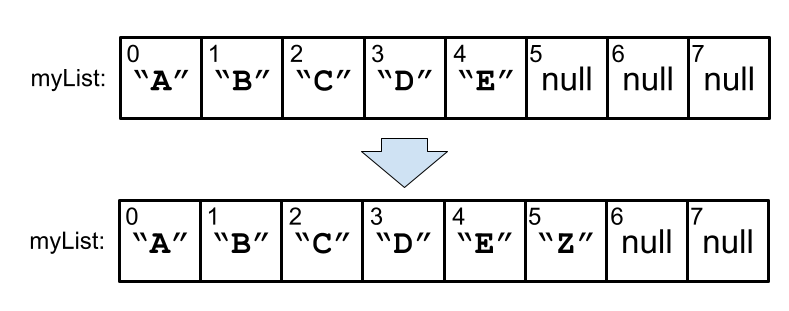
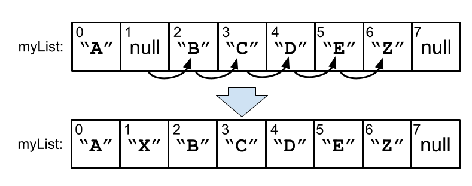
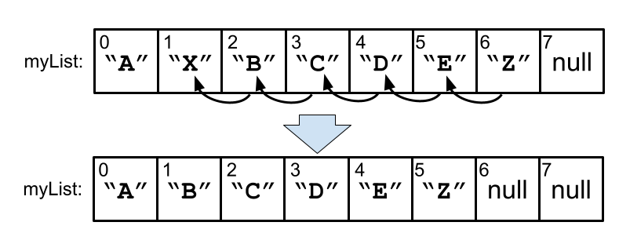
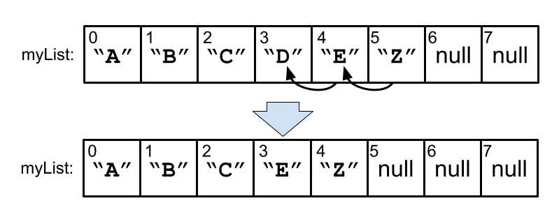
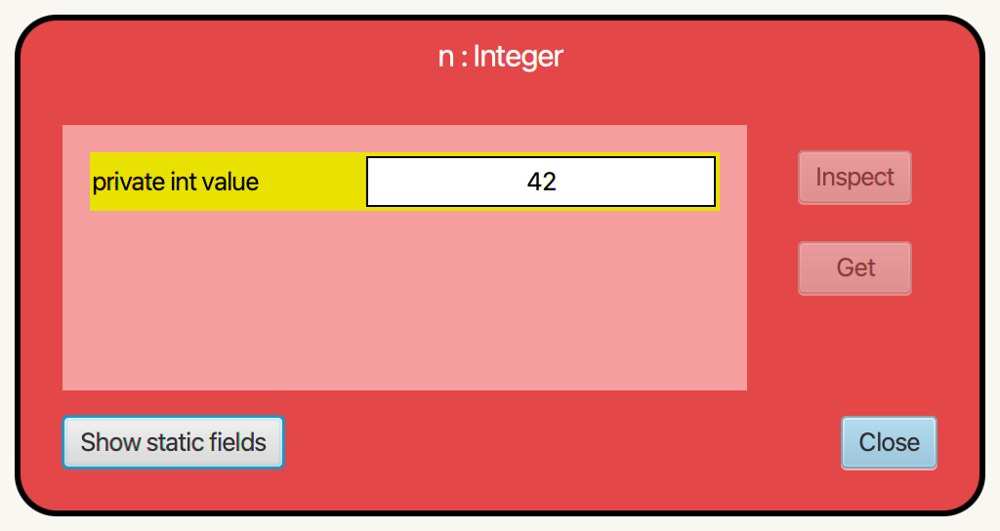

## Using ArrayLists

A close look at ArrayList methods with examples

---

### Quick Review of ArrayLists

--

An ArrayList is a data structure that can expand when adding items.

--

Resizing happens automatically.

We can essentially 'forget' about its inner-workings.

--

We can focus instead on the methods to add and remove items.

--

Let's now look at the interface we are given to work with ArrayLists.

---

### ArrayList Methods

- `add()`
- `remove()`
- `size()`
- `get()`
- `set()`
- `contains()`

--

We can `add()` to the end of a list.

```java
myList.add("Z");
```



`"Z"` was added at the end.

--

We can also `add()` at a particular index. Items will shift over to accomodate the new item.

```java
myList.add(1, "X");
```



`"X"` was added at index 1.

--

Likewise, we can `remove()` from the list by index.

```Java
myList.remove(1);
```



`"X"` used to be at index 1. Now it's gone.

--

Or you can `remove()` the first occurrence of the given object.

```Java
myList.remove("D");
```



We searched for the first `"D"` and removed it.

--

Retrieve the value at the given index with `get()`.

```Java
myList.get(3); // returns "E"
```


Note: The array `[]` syntax doesn't work.

You can't use `myList[3]`.

--

Overwrite the value at the given index with `set()`.

```Java
myList.set(3, "D");
```


Index 3 was set to `"D"`.

--

Check for the presence of a value with `contains()`.

```Java
myList.contains("Z"); // returns true
```


The ArrayList contains `"Z"`. True!

--

Get the length of the list with `size()`.

```Java
myList.size(); // returns 5
```


The size of the list is 5.

--

### Quick note:

Unfortunately, Java doesn't use consistent naming for the `size` function across different data types...

--

<table>
<tr>
<th>Data structure</th> <th>How to get its size</th>
</tr>
<tr>
<td>Strings</td> <td><code>.length()</code></td>
</tr>
<tr>
<td>Arrays</td> <td><code>.length</code></td>
</tr>
<tr>
<td>ArrayLists</td> <td><code>.size()</code></td>
</tr>
</table>

<br>Everyone agrees that this is annoying. 

But we're stuck with it.

--

Now we will look at the syntax for creating an ArrayList.

---

### Creating ArrayLists
Introducing the `< >` Syntax

--

First we will need to add an import:

```java

import java.util.ArrayList; ⬅︎

class ArrayListsAreFun
{
    ...
}

```

--

Now we can make the breakfast menu for the diner we've been dreaming of opening...

```java

import java.util.ArrayList;

class ArrayListsAreFun
{
    static void printBreakfastMenu()
    {
        ArrayList<String> menu = new ArrayList<String>();

        menu.add("pancakes");
        menu.add("eggs");
        menu.add("bacon");
    }
}

```

Let's go over the new syntax here.

--

ArrayList is a data type that represents a collection. 

The things in the collection have their *own* data type. 


```java
static void printBreakfastMenu()
{
               ⬇︎
    ArrayList<String> menu = new ArrayList<String>();

    menu.add("pancakes");
    menu.add("eggs");
    menu.add("bacon");
}
```

So `menu` is not just an ArrayList. 

It's an ArrayList of Strings

`ArrayList<String>` is the total data type.

--

Any *class* name can go inside the `<>` diamond syntax.

More on that later.

<br>
Back to our example.

--

We are creating an `ArrayList<String>` object using its constructor.

```java
static void printBreakfastMenu()
{
                                                  ⬇︎
    ArrayList<String> menu = new ArrayList<String>();

    menu.add("pancakes");
    menu.add("eggs");
    menu.add("bacon");
}
```

--

The `ArrayList<String>` starts out empty.

We can fill it using the `add` method.

```java
static void printBreakfastMenu()
{
    ArrayList<String> menu = new ArrayList<String>();

    menu.add("pancakes");  ⬅︎
    menu.add("eggs");
    menu.add("bacon");
}
```

--

Now let's print the menu.


```java
static void printBreakfastMenu()
{
    ArrayList<String> menu = new ArrayList<String>();

    menu.add("pancakes");  
    menu.add("eggs");
    menu.add("bacon");

    System.out.println("Breakfast menu:\n")
    for (String m : menu)   ⬅︎
    {
        System.out.println(m);
    }
}
```

This style of `for` loop works with ArrayLists. 

Yay!

--

Console output:

```text

Breakfast menu:

pancakes
eggs
bacon

```

--

We can also use a count-controlled `for` loop to do the same thing:

```java
static void printBreakfastMenu()
{
    ArrayList<String> menu = new ArrayList<String>();

    menu.add("pancakes");  
    menu.add("eggs");
    menu.add("bacon");

    System.out.println("Breakfast menu:\n")
    for (int i = 0; i < menu.size(); i++)   ⬅︎
    {
        System.out.println(menu.get(i));
    }
}
```

Notice that we had to get the items by index with `menu.get(i)`.

--

Console output:

```text

Breakfast menu:

pancakes
eggs
bacon

```

(same as before)

--

But maybe the best way to print ArrayLists is just to put it in a `System.out.println()`.

```java
static void printBreakfastMenu()
{
    ArrayList<String> menu = new ArrayList<String>();

    menu.add("pancakes");  
    menu.add("eggs");
    menu.add("bacon");

    System.out.println("Breakfast menu:\n")
    System.out.println(menu);  ⬅︎
}
```

--

Console output:

```text

Breakfast menu:

[pancakes, eggs, bacon]

```

If we tried to `println()` an ordinary array, we would have gotten gibberish instead of this nicely formatted list.

--

ArrayLists know how to print themselves nicely.

That's because they override the `toString()` method from the `Object` class.

--

Wait a minute. 

We forgot beverages.

--

Add coffee to the start of the list. 

Add orange juice at index 2.

```java
static void printBreakfastMenu()
{
    ArrayList<String> menu = new ArrayList<String>();

    menu.add("pancakes");  
    menu.add("eggs");
    menu.add("bacon");
    System.out.println("Breakfast menu:\n")
    System.out.println(menu); 

    menu.add(0, "coffee");
    menu.add(2, "orange juice");    ⬅
    System.out.println("\n\nRevised Breakfast menu:\n")
    System.out.println(menu);  
}
```

--

Concole output:

```text

Breakfast menu:

[pancakes, eggs, bacon]


Revised Breakfast menu:

[coffee, pancakes, orange juice, eggs, bacon]

```

Inserting items into a normal array would have been much harder to do.

--

Let's move on to another example.

---

### Another ArrayList example
Using `ArrayList<Integer>`

--

We will need a bit of money to open our diner.

Let's play the lotto.

--

We will generate some random numbers and add them to our list. Then we'll print them.

First, we make the empty ArrayList:

```java

static void luckyNumbers(int howMany)
{
                ⬇︎ 
    ArrayList<Integer> lotto = new ArrayList<Integer>();
}

```

Hey, why `Arraylist<Integer>`?

Why not `ArrayList<int>`? 

--

\* deep breath \*

--

The diamond syntax only allows the name of a class to be placed within it.

Try inserting a primitive type. It won't compile.

```java
    // The compiler won't allow the following:

❌  ArrayList<int> badList1;
❌  ArrayList<double> badList2;
❌  ArrayList<boolean> badList3;
❌  ArrayList<char> badList4;

```

--

We need to replace the primitive type with the class version of the same type:

```java
    // The following should be used instead:

✅  ArrayList<Integer> goodList1;
✅  ArrayList<Double> goodList2;
✅  ArrayList<Boolean> goodList3;
✅  ArrayList<Character> goodList4;

```

--

These are called "wrapper classes."

They're classes that wrap around a primitive type.

--

Because they are classes, they can fit in to the architectural patterns of Java.


They can take part in inheritance and polymorphism.

--

That's significant because the `ArrayList<E>` was programmed so that "`E`" would be some sort of `Object`.


Later on, it will be more clear why this matters.

--

Sometimes you'll hear the word "box" instead of "wrap" in this context.



As in: "The `Integer n `boxes the` int 42`."

--

Okay, back to gambling.

--

We need to fill our list with random numbers.

The user of the method will supply `howMany` we need to add to the list.

```java

static void luckyNumbers(int howMany)
{
    ArrayList<Integer> lotto = new ArrayList<Integer>();

    for (int i = 0; i < howMany; i++)  ⬅︎
    {
        // Generate random int from 0 to 99
        int r = (int) (Math.random() * 100);

        lotto.add(r);
    }

    System.out.println(lotto);
}

```

So we need a loop that runs `howMany` times.

--

Good for you if you noticed something suspicious about this step:

```java

static void luckyNumbers(int howMany)
{
    ArrayList<Integer> lotto = new ArrayList<Integer>();

    for (int i = 0; i < howMany; i++)
    {
        // Generate random int from 0 to 99
        int r = (int) (Math.random() * 100);

        lotto.add(r);  ⬅︎
    }

    System.out.println(lotto);
}

```

What would seem to be the problem with this line?

Maybe you could find two different issues with this.

--

- Issue 1: What's the deal with adding an `int` to an `ArrayList<Integer>`?

- Issue 2: What if we get the same number twice by chance? That's not how lotteries work.


```java

static void luckyNumbers(int howMany)
{
    ArrayList<Integer> lotto = new ArrayList<Integer>();

    for (int i = 0; i < howMany; i++)
    {
        // Generate random int from 0 to 99
        int r = (int) (Math.random() * 100);

        lotto.add(r);  ⬅︎
    }

    System.out.println(lotto);
}

```

--

Issue 2 is a real problem that we will address in a moment.

Issue 1 would be a problem, except that Java will automatically convert `int`s into `Integer`s when necessary.

--

Conversions between `int` and `Integer` happen whenever you need to use one type like the other.

<br><br>
It's a feature called autoboxing / autounboxing.

--

Back to issue 2.

How would you fix the problem of potentially getting duplicate numbers in the list?

```java

static void luckyNumbers(int howMany)
{
    ArrayList<Integer> lotto = new ArrayList<Integer>();

    for (int i = 0; i < howMany; i++)
    {
        // Generate random int from 0 to 99
        int r = (int) (Math.random() * 100);

        lotto.add(r);  ⬅︎
    }

    System.out.println(lotto);
}

```

Take some time now and find a solution.

--

Hint 1: 

Consider using an `ArrayList` method.

--

Hint 2: 

Use the `contains()` method in an if statement to guard this line.

```java
static void luckyNumbers(int howMany)
{
    ArrayList<Integer> lotto = new ArrayList<Integer>();

    for (int i = 0; i < howMany; i++)
    {
        // Generate random int from 0 to 99
        int r = (int) (Math.random() * 100);

        lotto.add(r);  ⬅︎
    }

    System.out.println(lotto);
}
```

--

This is a little better, but now we've introduced another problem.

```java
static void luckyNumbers(int howMany)
{
    ArrayList<Integer> lotto = new ArrayList<Integer>();

    for (int i = 0; i < howMany; i++)
    {
        // Generate random int from 0 to 99
        int r = (int) (Math.random() * 100);

        if (!lotto.contains(r)) ⬅︎
        {
            lotto.add(r);  
        }
    }

    System.out.println(lotto);
}
```
What is it?

--

We may have fewer than `howMany` items in the list.

Think of a way to fix this issue.

--

Maybe this is the best way:
```java
static void luckyNumbers(int howMany)
{
    ArrayList<Integer> lotto = new ArrayList<Integer>();

    while (lotto.size() < howMany)    ⬅︎
    {
        // Generate random int from 0 to 99
        int r = (int) (Math.random() * 100);

        if (!lotto.contains(r))
        {
            lotto.add(r);  
        }
    }

    System.out.println(lotto);
}
```

--

There is one more issue.

Can you think of a reason why this method would potentially get stuck in an infinite loop?

```java
static void luckyNumbers(int howMany)
{
    ArrayList<Integer> lotto = new ArrayList<Integer>();

    while (lotto.size() < howMany)
    {
        // Generate random int from 0 to 99
        int r = (int) (Math.random() * 100);

        if (!lotto.contains(r))
        {
            lotto.add(r);  
        }
    }

    System.out.println(lotto);
}
```

--

If `howMany = 137`, for instance, the method would never complete.

```java
static void luckyNumbers(int howMany)
{
    if (howMany > 100)   ⬅︎
    {
        throw new IllegalArgumentException( "Input out of " +
        "range. Cannot generate more than 100 unique values " + 
        "from 0-99.");
    }

    ...
}
```

So we'll check for a valid input right at the start.

--

Tha's all for this example.

We've seen that the ArrayList's `contains()` method is handy!

It was easier to write this with an ArrayList than it would have been to use a normal array.

--

Let's see one more example.

This time we'll make our own simple class and put objects of the class in the ArrayList.

---

### Final ArrayList Example

ArrayLists and custom objects

--

It turns out that playing the lottery is a great way to lose money, not make it.

The real money is in starting up a casino.

The house always wins.

--

Let's make some playing cards that will be used for our games.

--

A simple `Card` class might look like this:

```java
class Card
{
    enum Suit { SPADES, HEARTS, CLUBS, DIAMONDS }
    
    Suit suit;
    int rank;

    
}
```

We use an inner `enum` class to enumerate the suits.

The "rank" of a card (Ace - King) will be an `int`.

This design decision lets us easily compare and order cards (should we ever decide to do that).

--

Let's think about the constructor:

```java
...

Card(int rank, Suit suit)
{
    this.rank = rank;  ⬅︎
    this.suit = suit;
}

...
```

The suits are enumerated, so they can't be given an invalid value.

The ranks, though? 

They could be given an input that's out of range.

--

Exercise:

Add data validation to the constructor. 

```java
...

Card(int rank, Suit suit)
{
    this.rank = rank;  ⬅︎
    this.suit = suit;
}

...
```
Note: 1 = Ace and 13 = King.

--

We throw an exception if the input is out of range:

```java
...

Card(int rank, Suit suit)
{
    if (rank < 1 || rank > 13)
    {
        throw new IllegalArgumentException(
            "Card ranks must be between 1 and 13.");
    }
    this.rank = rank;
    this.suit = suit;
}

...
```

--

We will add one more method to the `Card` class.

We will override `toString` so we can print our cards out like this: ♠︎A ♡3 ♣︎K ♢J .

Card suits are in the unicode list of symbols.

So we can use them inside of Strings in our program.

--

We add the suit symbol and the rank symbol to a String and return it at the end:

```java
...

@Override
public String toString()
{
    String cardString = "";

    if (suit == Suit.SPADES) cardString += "♠︎";
    else if (suit == Suit.HEARTS) cardString += "♡︎";
    else if (suit == Suit.CLUBS) cardString += "♣︎";
    else cardString += "♢";

    if (rank == 1) cardString += "A";
    else if (rank == 11) cardString += "J";
    else if (rank == 12) cardString += "Q";
    else if (rank == 13) cardString += "K";
    else cardString += Integer.toString(rank);

    return cardString;
}

...
```

--

Now we have a class to represent cards.

Let's create a class that will represent a collection of cards.

--

Our `Deck` class will wrap an ArrayList. 

It will include the basic methods that all card games need.

--

This is a good start:

```java
import java.util.ArrayList;

class Deck
{
    ArrayList<Card> cards;

    Deck()
    {
        cards = new ArrayList<Card>();
    }
}
```

--

But adding cards this way is going to get ugly:

```java
...

Deck()
{
    cards = new ArrayList<Card>();

    cards.add(new Card(1, Card.Suit.SPADES));
    cards.add(new Card(2, Card.Suit.SPADES));
    cards.add(new Card(3, Card.Suit.SPADES));
    cards.add(new Card(4, Card.Suit.SPADES));
    // sigh...
}

...
```
There's gotta be a better way to fill this ArrayList.

Exercise: Abandon this strategy. Instead, write a concise section of code to create a complete deck.

--

Here's a way using an outer for loop for the suits.

The inner for loop cycles through all 13 ranks.
```java
...

Deck()
{
    cards = new ArrayList<Card>();
    
    for (int s = 1; s < 5; s++)
    {
        for (int r = 1; r < 14; r++)
        {
            Card.Suit suit;
            if (s == 1) suit = Card.Suit.SPADES;
            else if (s == 2) suit = Card.Suit.HEARTS;
            else if (s == 3) suit = Card.Suit.CLUBS;
            else suit = Card.Suit.DIAMONDS;
            
            cards.add(new Card(r, suit));
        }
    }
}

...
```

--

Looping through the values of an enum is a pretty common task.

So Java gives us the `values()` method to return an array of the enum's values.

--

So here's an even more concise way to write that part of the constructor:

```java
Deck()
{
    cards = new ArrayList<Card>();
    
    for (Card.Suit s : Card.Suit.values())  ⬅︎
    {
        for (int r = 1; r < 14; r++)
        {
            cards.add(new Card(r, s));
        }
    }
}
```
The two styles of for loop working in harmony...

It's beautiful.

--

Now we have a rather orderly deck.

We need a method to randomize it.

--

Two possible strategies occur:
1. We could shuffle and deal off the end of the array.
2. We could pick a random index and deal from "the middle" without shuffling.

--

Let's pursue strategy 2. 

It seems simpler to code.

--

Exercise: 

Write a method called `randomDeal()` that returns a `Card` object from a random position in the deck. 

The method should also remove that card from the deck's ArrayList. 

We don't want no double-dealing. 

We're an honest establishment!

--

Hint 1:

```java
Card randomDeal()
{
    int randIndex = ...
}
```

--

Hint 2:

```java
Card randomDeal()
{
    int randIndex = (int) (Math.random() * cards.size());

    Card c = ...
    
    ...
    
    return c;
}
```

--

Solution:

```java
Card randomDeal()
{
    int randIndex = (int) (Math.random() * cards.size());

    Card c = cards.get(randIndex);
    
    cards.remove(randIndex);
    
    return c;
}
```

We could also have used `cards.remove(c)`

But removing by index will be quicker than searching to remove a particular object.

--

Let's also appreciate that our method only works because of how ArrayLists keep their data.

Removing values at an index doesn't leave behind any annoying gaps.

--

That's all for the examples.

Try some challenge problems.

---

### Challenge Problems:

--

Challenge 1:

Write a static method called `splitEvenOdd(int[] numbers)`. It takes an ordinary `int[]` array of numbers and classifies them by putting them into an evens and odds ArrayList. 

Then it should print them to the console.

Example input: `{8, 2, 9, 1, 3, 11, 7, 6, 7}`

Expected output:
```text

Evens: [8, 2, 6]
Odds: [9, 1, 3, 11, 7, 7]

```
Hint: Use `n % 2 == 0` to test whether n is even.

--

Challenge 2: 

Write the method `dealHands()` that will deal out 5 card poker hands to four different players.

Their hands should be printed to the console like this:

```text

Player 1: ♠6 ♠A ♣4 ♡8 ♡2 
Player 2: ♡5 ♢3 ♡K ♣A ♣K 
Player 3: ♡J ♡7 ♢A ♣8 ♣2 
Player 4: ♣10 ♢K ♢7 ♡Q ♡4

```

--

Challenge 3: 

A list of prime numbers can be generated by trial division. Write the static method `printPrimesUpto(int n) ` by implementing the following algorithm.

Algorithm: 
1. Begin the list of primes with only 2 in it.
2. Iterate from 3 to `n`.
3. Add the number to the list of primes if it is not divisible by any number in the list. 

Hint: Use `%` to get the division remainder.

--

Challenge 3:

A list of fibonacci numbers begins `[1, 1, ...]`  and can be continued by appending the sum of the last two elements in the sequence. Write the static method `printFibs(int howMany)` that will print out a list of `howMany` fibonacci numbers.

Example: calling `printFibs(10)` should give the following console output:

```text

[1, 1, 2, 3, 5, 8, 13, 21, 34, 55]

```

--

Challenge 4:

Write the static method `removeDuplicates(String[] words)` that takes an ordinary String[] array and prints the same array back with duplicates removed:

Example input: `{"The", "land", "of", "of", "the", "land", "free", "of", "the", "free"}`

Expected output:

```text

[The, land, of, the, free]

```

Notice that "The" and "the" are different Strings.

--

Challenge 5:

Rewrite the `luckyNumbers()` method to use a normal `int[]` array. Avoid using an ArrayList altogether.

The method must have the same functionality and print to the console in the same format.

--

Challenge 6:

Implement a `shuffle()` method for our `Deck` class.

Write the method twice... 
1. The first time will be based on your own idea of how to randomize an ordered set. Try anything you think will work.

2. And the second time you write the method will be after researching the Fisher-Yates shuffling algorithm. Do not specifically search for a Java implementation of the algorithm. Your goal is to implement it in Java on your own.

--

Good luck!
