## Data Structures
Beyond the basic array.

---

## Review: Normal Arrays

- Very fast
- Fixed size at creation
- Only one data type

--

An array is a fixed block of computer memory.

--

Arrays are surrounded by other data in memory.

--

It's not safe to add data to the end of an array.

So it's not allowed.

--

But what if we need a data structure that has room to grow?

--

For example, in an ecosystem simulation, it doesn't make sense to have a fixed population cap.

--

If you store the organisms in a normal array, you might run out of room as they reproduce.

--

The solution is to use a new data structure called an `ArrayList`. 

`ArrayList`s know how to expand in a safe way.

---

## The ArrayList

Arrays that know how to grow.

--

An ArrayList looks like this. 

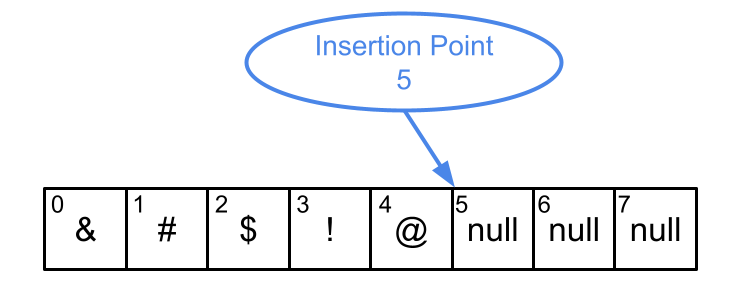

--

It's just an ordinary array with extra space at the end.

It keeps track of the index of the next open slot.

--

Let's see what happens as we fill these empty slots...

--

Added % in slot 5...

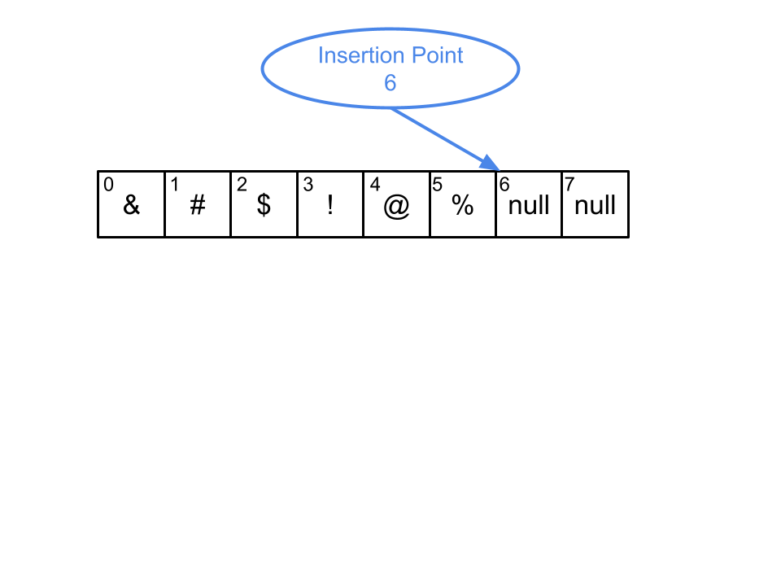

--

Added X in slot 6...

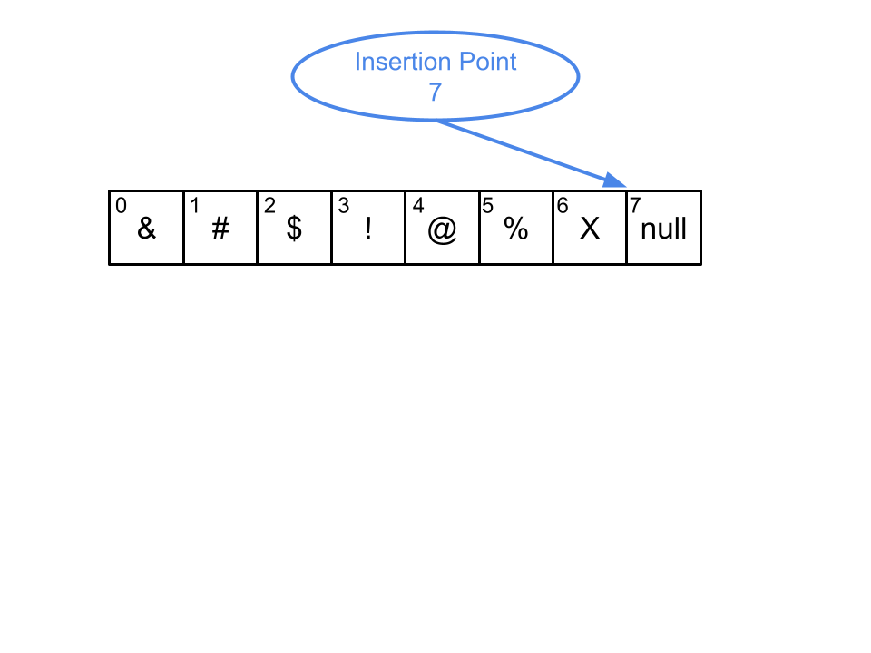

--

Added Ψ in slot 7...

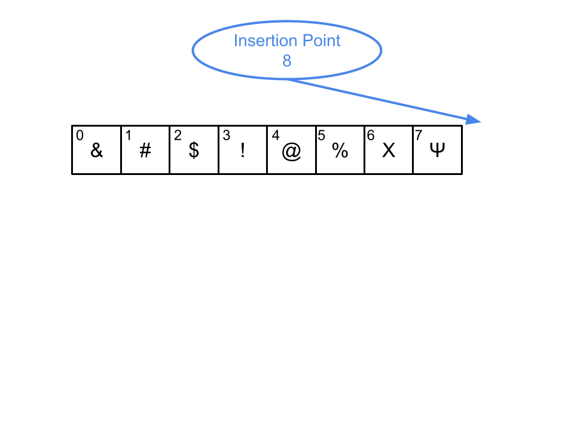

--

Out of room! Create a new array with even more available space.

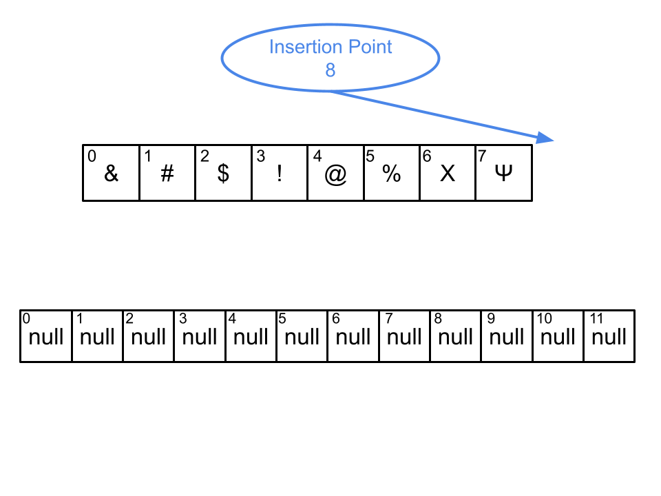

--

Copy over the old values.

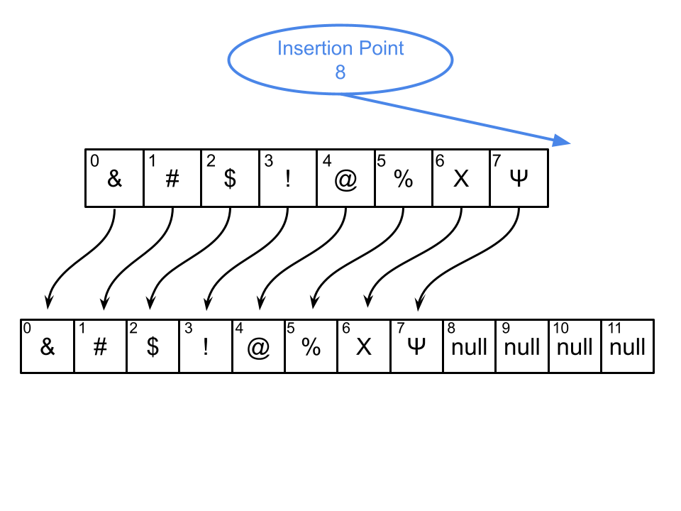

--

Use the expanded array for all future operations.

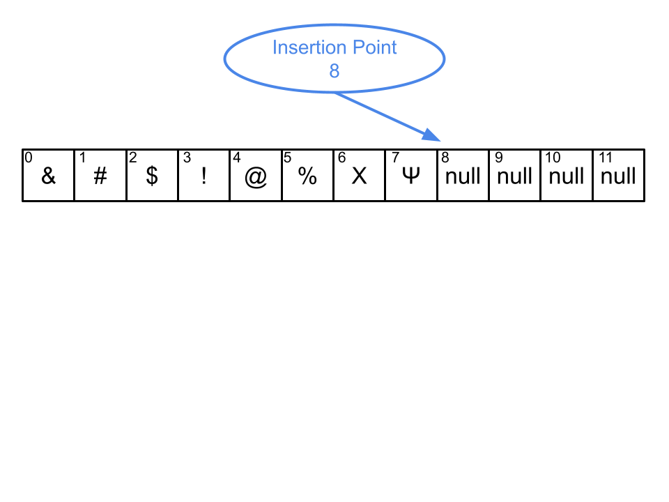

--

The ArrayList is programmed as a smart object.

It knows how to expand itself automatically whenever it runs out of capacity.

--

As users, we don't need to keep track of the insertion point or the capacity.

Everything is managed for us behind the scenes.

It just works.

--

ArrayLists are just the beginning.

There are many other data structures out there.

--

The different data structures try to accomplish something that the basic array can't easily do.

Let's quickly look at a few other types.

---

## Other Types of Data Structures

Note: We won't use these in this class, but they are nice to know about.

---

### The LinkedList

--

LinkedLists are made when cells of memory contain data along with the address of the next cell.

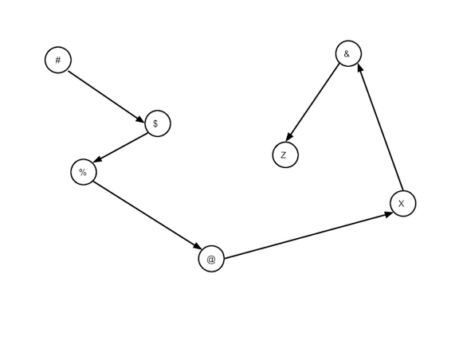

--

Advantage: very flexible. 

Doesn't need to be in a single block of memory.  

No performance penalty for resizing.

--

It's very easy to add new items to the list.

Other items don't need to shuffle around in memory.

Just tell the cells that they have a new "neighbor".

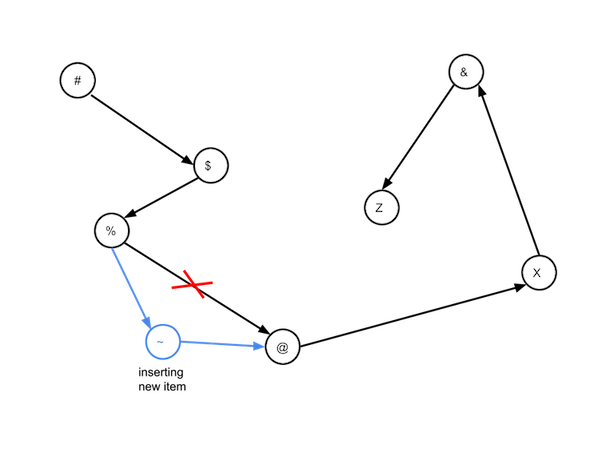

--

Disadvantage: Can't immediately retrieve an item by index.

Getting item #500 takes 500 times longer than getting item #1 because the list is walked from head to tail.

--

We say that LinkedLists don't allow "random access" like an array or an ArrayList does.

That's a big disadvantage.

---

### The Tree

--

A Tree data structure represents data in a hierarchy.

--

They are made like a LinkedList, but with more branches.

--

They can be used to represent a file system.

--

They can represent different outcomes of a game or a conversation.

--

Also used for modelling grammatical structures in human languages.

--

Trees are used to model computer languages as well.

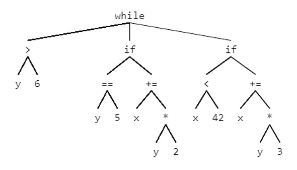

--

In fact, every time you compile a Java program, the source code is parsed as an *abstract syntax tree*.

--

Creating an abstract syntax tree is one of the important steps in compiling a program.

Compiling means converting the program into machine code.

---

### The Stack

--

A stack is a simple resizable data structure.

You can only add or remove items from the "top" of the stack.

--

Like a stack of papers or a stack of plates, the last items added are the first ones that must be removed.

The oldest items are at the bottom.

--

At first glance, they sound too simple to be very useful.

--

But in fact, they are used constantly whenever we run a program in Java.

Each method call creates a new stack frame.

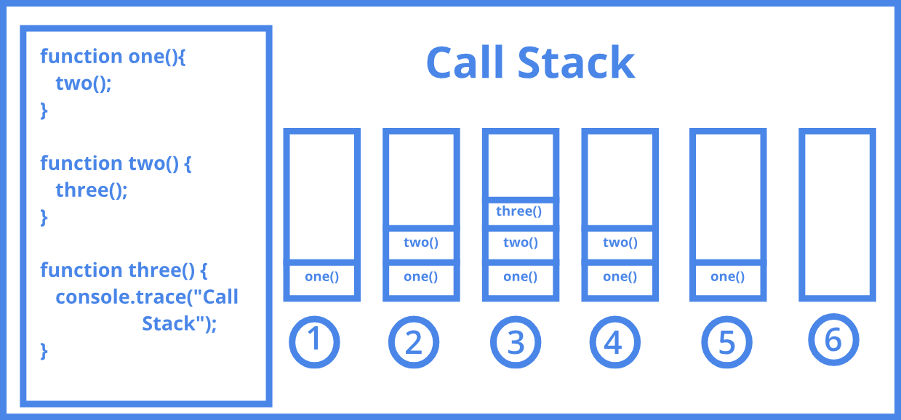

--

A stack frame contains the local variables and the current state of the program.

--

A stack frame is removed when the method call returns.

--

Using the debugger, we can see the current state of the program by looking at the call sequence stack.

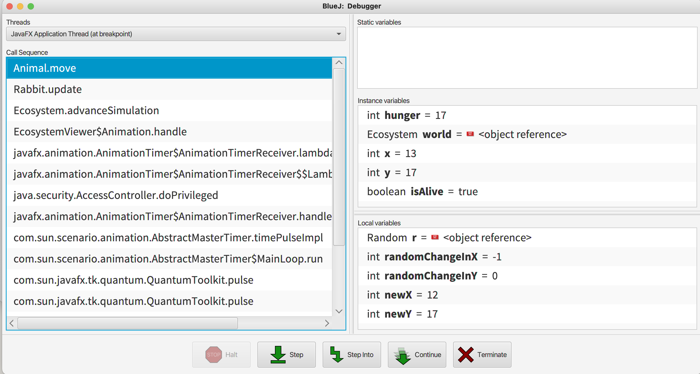

--

If you go on to study computer science, these concepts will be explored in much more depth.

---

### Conclusion

Data structures are a core part of computer science.

--

Understanding which data structure to use for the task at hand is an important part of learning how to program.

--

Going forward, we will only focus on the ArrayList.

We will learn how to make one from scratch and we will practice using them to solve problems.